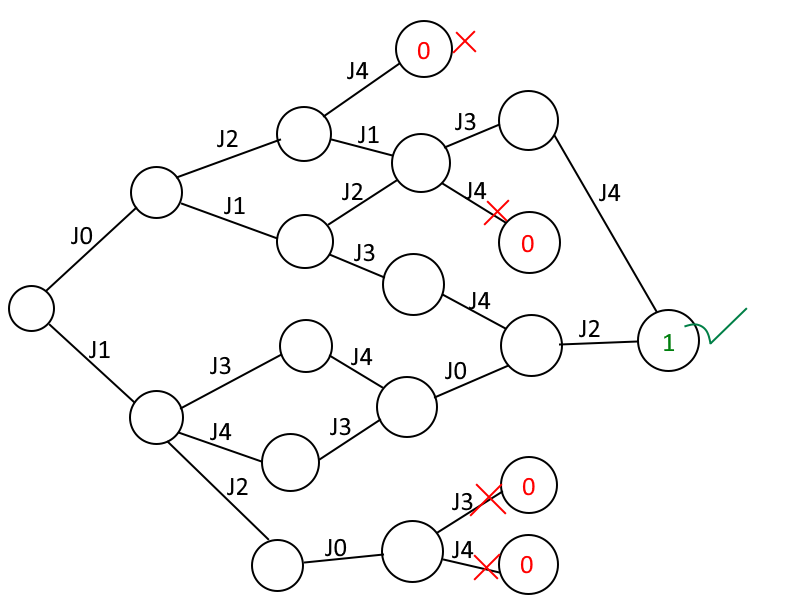
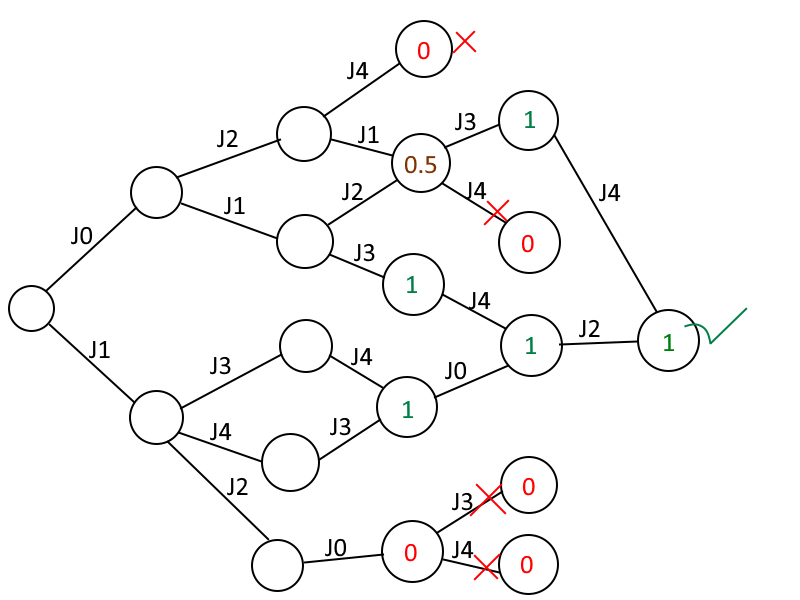
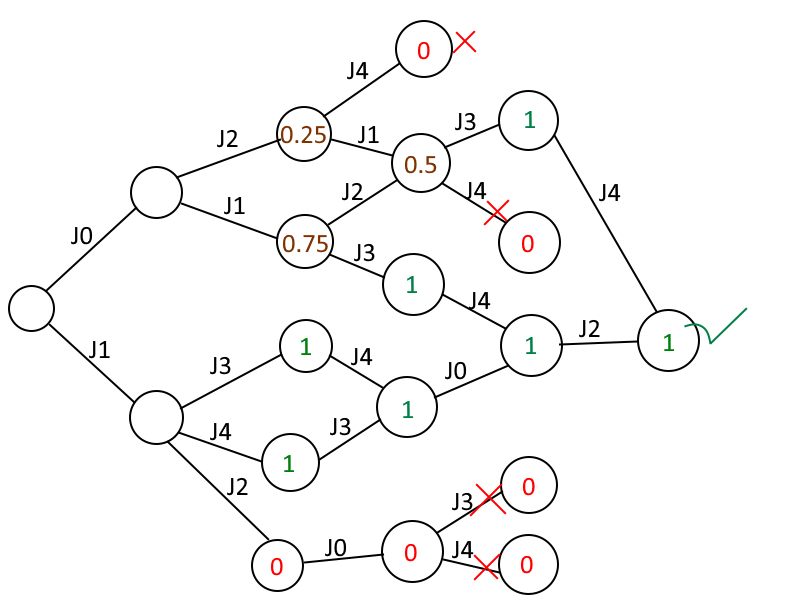
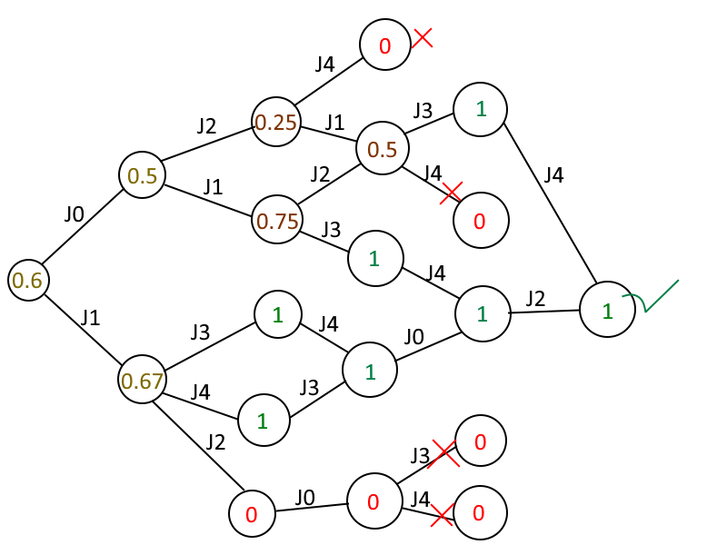
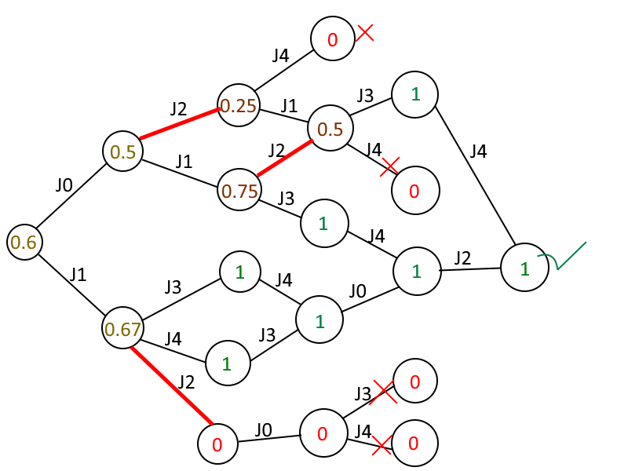
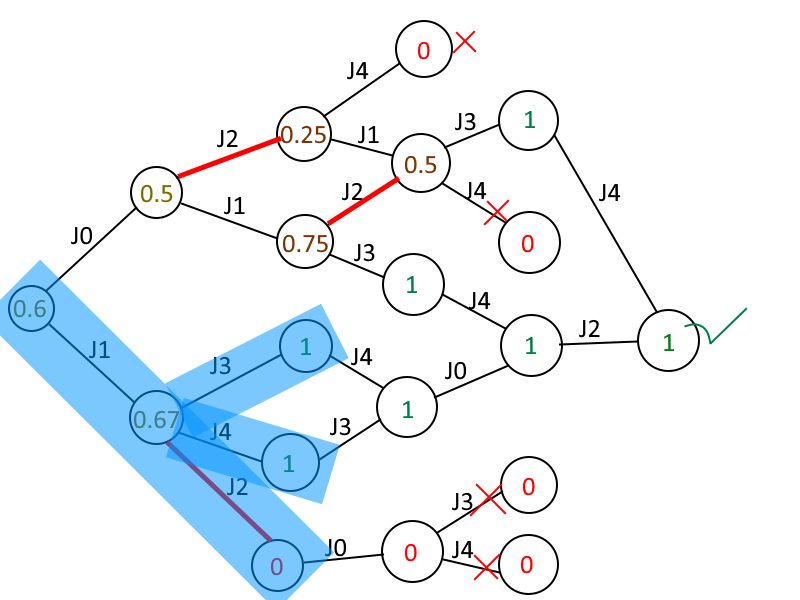

# Automatic reconfiguration, the first prototype
## The flow
I added a `--reconfigure` argument to the CLI. When present, the tool will call
`NP::Reconfiguration::Manager::run_with_automatic_reconfiguration(const Options options, Scheduling_problem<Time> problem)`.
The `run_with_automatic_reconfiguration` function will check whether the given problem is schedulable. If it's already schedulable,
it will just print
```
The given problem is already schedulable
```
and quit.

If it's not schedulable, it will try a number of *reconfiguration strategies* to find potential adaptations that would make
the problem schedulable. As soon as any strategy finds a solution, it will be printed to stdout, after which it quits. An
example output is given below:
```
The given problem is not schedulable, but you can make it schedulable by following these steps:
Increase the best-case running time of the job with ID T1J1 from 1 to the worst-case running time 2
Increase the best-case running time of the job with ID T2J7 from 7 to the worst-case running time 8
```
When a strategy does not manage to find a solution, the program will attempt the next strategy. When all strategies fail,
it will print 
```
The given problem is not schedulable, and I couldn't find a solution to fix it
```
and quit.

## The reconfiguration agent
All strategies work by repeatedly checking whether the problem is schedulable (each time with a slight variation of the
problem), using `NP::Global::State_space<Time>::explore`. In many iterations, they need to extract information during
the exploration, and possibly manipulate its execution. Since the `State_space` class is long and complicated enough
as-is, I wanted to push these extra strategy manipulations and data collection into different classes. To do so, I gave
the `State_space` class a `Reconfiguration_agent` field.
```diff
    bool use_supernodes = true;
+	Reconfiguration::Agent<Time> *reconfiguration_agent;

    State_space(const Workload& jobs,
        const Precedence_constraints& edges,
        const Abort_actions& aborts,
        unsigned int num_cpus,
        double max_cpu_time = 0,
        unsigned int max_depth = 0,
        bool early_exit = true,
 		bool use_supernodes = true,
+		Reconfiguration::Agent<Time> *reconfiguration_agent = nullptr)
        : jobs(jobs)
```
During normal explorations, the `reconfiguration_agent` will be `nullptr`, which means that the exploration is not
manipulated, and no extra data is stored.

### Manipulation
The reconfiguration agent is allowed to manipulate the exploration process by forbidding some edges to be taken
```diff
    Time t_high_wos = next_certain_higher_priority_seq_source_job_release(n, j, upbnd_t_wc + 1);
    // if there is a higher priority job that is certainly ready before job j is released at the earliest, 
    // then j will never be the next job dispached by the scheduler
    if (t_high_wos <= j.earliest_arrival())
        continue;
+
+   // The reconfiguration agent can forbid transitions
+   if (reconfiguration_agent && !reconfiguration_agent->is_allowed(n, j)) continue;
+
    found_one |= dispatch(n, j, upbnd_t_wc, t_high_wos);
```
or by forbidding the merge of two nodes.
```diff
for (Node_ref other : pair_it->second)
    {
        if (other->get_scheduled_jobs() != sched_jobs)
            continue;

+		if (reconfiguration_agent && !reconfiguration_agent->allow_merge(n, j, *other)) continue;
+
        // If we have reached here, it means that we have found an existing node with the same 
        // set of scheduled jobs than the new state resuting from scheduling job j in system state s.
        // Thus, our new state can be added to that existing node.
        if (other->merge_states(st, false))
        {
            delete& st;
+           if (reconfiguration_agent) reconfiguration_agent->merge_node_attachments(other, n, j);
            return *other;
        }
    }
```
Forbidding certain edges can be used to limit the exploration to the paths in which the agent is
interested. Forbidding merges can be used to e.g. forbid merges when exactly 1 of the two nodes has
already missed a deadline, which messes up the administration of some strategies.

### Data storage
The reconfiguration agent is also allowed to store arbitrary per-node data. I added an `attachment` to
the `Schedule_node` class:
```diff

public:
+   Reconfiguration::Attachment *attachment;

    // initial node
    Schedule_node(
        unsigned int num_cores,
        const Time next_earliest_release = 0,
        const Time next_certain_source_job_release = Time_model::constants<Time>::infinity(), // the next time a job without predecessor is certainly released
        const Time next_certain_sequential_source_job_release = Time_model::constants<Time>::infinity(), // the next time a job without predecessor that can execute on a single core is certainly released
+       Reconfiguration::Attachment *attachment = nullptr
    )
```
The `Reconfiguration::Attachment` struct is just an empty abstract struct, meant to be extended by subclasses.
The `State_space` allows the reconfiguration agent to create the attachments:
```diff
    Time next_certain_release = std::min(next_certain_seq_release, next_certain_gang_release);

+   Reconfiguration::Attachment *attachment = nullptr;
+   if (reconfiguration_agent) attachment = reconfiguration_agent->create_initial_node_attachment();

-   Node& n = new_node(num_cores, jobs_by_earliest_arrival.begin()->first, next_certain_release, next_certain_seq_release);
+   Node& n = new_node(num_cores, jobs_by_earliest_arrival.begin()->first, next_certain_release, next_certain_seq_release, attachment);
    State& s = new_state(num_cores, next_certain_gang_release);
```
```diff
+   Reconfiguration::Attachment *attachment = nullptr;
+   if (reconfiguration_agent) attachment = reconfiguration_agent->create_next_node_attachment(n, j);
+
    Node& next_node = new_node(n, j, j.get_job_index(),
        earliest_possible_job_release(n, j),
        earliest_certain_source_job_release(n, j),
        earliest_certain_sequential_source_job_release(n, j),
+       attachment);
```
Most reconfiguration agents need attachments to keep track of some data, for instance whether a deadline has been missed already,
or more detailed information about the taken edges. Some even track the relation with nodes in another graph.

### Signalling
Finally, the `State_space` will also signal deadline misses, dead ends, and completions to the reconfiguration agent.
```diff
if (j.exceeds_deadline(range.upto())) {
    observed_deadline_miss = true;
+   if (reconfiguration_agent) reconfiguration_agent->missed_deadline(n, j);

    if (early_exit)
        aborted = true;
}
```
```diff
    // check for a dead end
    if (!found_one && !all_jobs_scheduled(n)) {
        // out of options and we didn't schedule all jobs
        observed_deadline_miss = true;
-       aborted = true;
+       if (early_exit) aborted = true;
+       if (reconfiguration_agent) reconfiguration_agent->encountered_dead_end(n);
+   } else if (reconfiguration_agent && found_one && current_job_count == jobs.size() - 1) {
+       reconfiguration_agent->finished_node(n);
    }
```
This information is very useful, for instance to find out where deadline misses happen, or whether a particular deadline
miss has been prevented.

## The strategies
Each strategy will explore the problem repeatedly, each time with a slight variation and/or a different reconfiguration agent.

### The pessimism strategy
Since the scheduler is assumed to be non-preemptive, it is possible that failures occur only when
jobs do **not** run for their WCET. In such cases, the task set can become schedulable by making all
jobs (or a subset of jobs) always run for their WCET (the engineer can e.g. use busy waiting to
accomplish this). The pessimism strategy will try to make the problem schedulable by making some
jobs always use their WCET.

It starts by creating a copy of the problem, called the *adapted problem*, and changing the BCET of
all *interesting* jobs to their WCET, and also change their best-case arrival times to their worst-case 
arrival times. To determine which jobs are *interesting*, it will explore the graph with a reconfiguration
agent that tracks which jobs are taken between the start of the exploration, and the nodes where deadlines
are missed. Any job that is taken anywhere before a deadline miss, is deemed *interesting*.
After making all *interesting* jobs pessimistic, it will call `State_space<Time>::explore` to check whether 
the *adapted problem* is schedulable. If not, it will give up (and the program will try the next strategy).

If the *adapted problem* is schedulable, the strategy knows that the problem can be made schedulable
by simply assuming pessimistic execution times and arrival times. I could simply tell the user to
force all jobs to use their WCET and worst arrival time, but this is usually more work than needed.
In most cases, making only a few jobs pessimistic will fix the problem.

Ideally, I would find the minimum number of jobs that need to become pessimistic, but finding this is
probably an NP-hard problem. Instead, I will look for a local minimal number of jobs that need to
become pessimistic. It will use the following procedure:
```
for each interesting job in the adapted problem:
  reset its BCET to the original BCET
  if the adapted problem is still schedulable:
    keep the original BCET
  else:
    change the BCET back to the WCET
    add the job to the list of pessimistic BCET jobs
  reset its BCAT to the original BCAT
  if the adapted problem is still schedulable:
    keep the original BCAT
  else:
    change the BCAT back to the WCAT
    add the job to the list of pessimistic BCAT jobs
```
Finally, it will print the list of BCET jobs and BCAT jobs to stdout. This will be a local minimal number
of jobs since removing the pessimism of any job will make the problem unschedulable. Since this strategy
managed to find a solution, no other strategies will be tried, and the problem quits.

Note that this strategy needs to be revisited in the future since trying each job 1-by-1 will take too
much time when there are thousands of jobs...

### The rating graph strategy
The rating graph strategy starts by exploring the problem, while using a reconfiguration agent that will give
each node in the SAG a *rating* between 0 and 1.
- When a deadline is missed after taking an edge/job, the destination node gets a rating of 0. Furthermore, no
children of that node will be visited.
- When a node is a dead end, it also gets a rating of 0.
- Any leaf nodes without deadline misses will get a rating of 1.
- The rating of any node that is not covered by any of the 3 cases above will be the average of the rating of its children.

I will demonstrate this concept on an example graph below:

- The edges are labeled with the taken jobs.
- The deadline misses are denoted by red crosses through the edge that leads to the miss.
- The dead ends are denoted by red crosses after a node without outgoing edges.
- The end of the successful paths is denoted by a green check after the leaf node.
- The rating of each node is written inside the node.

In the graph above, only the failed nodes and the leaf node have a rating. The rest of the ratings are determined by
taking the average of the child ratings. They will be assigned by traversing the graph from end to start. Step 1:


Step 2:



Step 3:



Step 4 and 5:



Once all ratings have been assigned, the strategy needs to decide which edges should be deleted. The rating graph made
above should guide the decisions, but there is not always a hard rule that tells which edges are best to delete.
For instance, there are multiple ways to cut the upper part of the graph above:
- We could cut J0 -> J2 -> J4 and J0 -> J1 -> J2
- We could cut J0 -> J2 and J0 -> J1 -> J2
- We could cut the J0 edge from the root node (deleting the whole upper part of the graph)

The difference between these first 2 solutions is not very significant, but the third solution is quite influential.
The advantage of cutting the first J0 edge, is that only 1 cut is needed. The drawback is that the number of correct paths
is also decreased, which means that the graph becomes less robust. This can be problematic since deleting an edge may
'accidentally' also delete other edges. For instance, if an edge is deleted by adding a precedence constraint, that extra
precedence constraint could also delete edges elsewhere in the graph. If the number of correct paths is small, these are
more likely to cause dead ends.

In this example, I will assume that the following selection of cuts (red edges) is chosen:



After the cuts have been chosen, it's time to decide *how* we should delete these edges.
From now on, I will refer to this as *performing the cut*.
There are multiple ways to do this, for instance by:
- Adding a precedence constraint. For instance, the J1 -> J2 cut could be performed by adding a precedence constraint that ensures
J2 must happen after J3 or J4.
- Adding a suspension. For instance, the J1 -> J2 cut could be performed by adding a suspension time between J1 and J2.
- Increasing the best-case execution times or arrival times on the path (also their worst-case if needed). The reasoning is similar
to that of the pessimistic strategy.
- Splitting up (long) jobs (and using precedence constraints or priorities to ensure that the job segments execute in the right order).
This could for instance avoid hazards where long low-priority jobs block higher priority jobs.

Note that not all of these solutions can be applied in all cases, and that some may cause problems elsewhere in the graph.
Furthermore, some solutions might accidentally perform multiple cuts. For instance, adding a precedence constraint between J4 and
J2 would perform all 3 cuts!

I will sort the cuts by their distance to the root node, and perform them 1-by-1.
For each cut, several solutions will be attempted, until a good solution is found.
To evaluate the effectiveness and side effects of potential solutions, I made 2 more agents.

#### Agent_cut_check
The `Agent_cut_check` tests whether a given cut has been performed. This agent is needed when we are trying to perform a cut,
by using a solution that may or may not work. The agent will manipulate the exploration such that it will only take edges which
could potentially lie on a path to the cut, as well as the siblings of the failed edge.
For instance, to check whether the J1 -> J2 cut is performed, it would only explore this part of the graph:



The agent will check whether the node after J1 -> J2 is reached. If so, the potential solution has failed.
Furthermore, the agent will check whether no other (unexpected) deadline misses or dead ends are encountered.
If any are encountered, the solution is also considered to be bad.

When the cut check fails, a different solution should be tried.

#### Agent_cut_test
The `Agent_cut_test` tests whether a given cut has been performed **without causing additional deadline misses**.
Note that there are 3 types of cuts to consider:
- The cuts that have already been performed, which I will refer to as the *past cuts*
- The cut for which a solution is being evaluated, which I will refer to as the *candidate cut*
- The cuts that have not been performed yet, which I will refer to as the *future cuts*

The *future* cuts are annoying, because the problem will obviously not become schedulable until they are performed.
However, we need to evaluate the solutions to the *candidate* cut first before going after the *future* cuts.
To handle this problem, the `Agent_cut_test` needs to know the list of *future* cuts,
and it will manipulate the exploration such that the forbidden edges of these cuts will **not** be taken.
Thus, when the *candidate* cut and all *past* cuts have been performed correctly,
the manipulated exploration will conclude that the problem is schedulable.
If the manipulated exploration concludes that the problem is **not** schedulable,
something must be wrong with the attempted solution to the *candidate* cut (or it conflicts with the *past* cuts),
hence another solution should be attempted.

As a bonus, the `Agent_cut_test` also remembers which of the *future* cuts it actually blocked.
When it did *not* block a *future* cut, it must accidentally have been performed as a side-effect of the
attempted solution to the *candidate* cut.
In such cases, the solution is extra good, since it performed multiple cuts!

## Performance and memory
At this point, the code contains plenty of memory leaks and needless copies. Thus, I suspect that it will take ridiculously much time when
tested on large problems.
